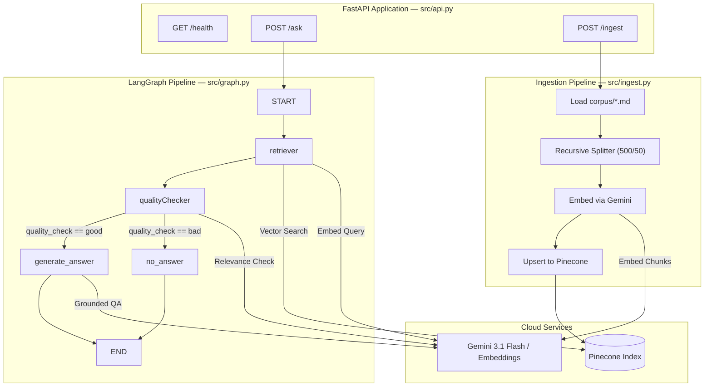

# Legal RAG API

A production-ready, agentic Question-Answering API for legal documents powered by **LangGraph**, **Gemini**, **Pinecone**, and **FastAPI**.
(Video attached below)

---

## 🏗️ System Architecture



For complete details on the state machine topology and node execution logic, see [`docs/langgraph.md`](docs/langgraph.md).

---

## ✨ Features

- **Two-Stage Quality Gate:** Combines fast vector score filtering (`SCORE_THRESHOLD = 0.60`) with an LLM relevance check to eliminate hallucinated answers on out-of-domain queries.
- **Context-Grounded Generation:** Prompt-level guardrails strictly prohibit inventing facts or using outside knowledge.
- **Centralized Configuration:** Managed in [`src/config.py`](src/config.py) for clean separation of environment, models, and hyperparameters.
- **Async Execution:** Fully async FastAPI endpoints leveraging LangGraph's native `ainvoke`.
- **Ingestion Guard:** Idempotent document ingestion with stats checking (`?force=true` override).
- **Postman Ready:** Complete test case corpus and evaluation support.

---

## 📂 Directory Structure

```
legal-rag-api/
├── corpus/                # Markdown legal document corpus (9 documents)
│   └── README.txt
├── docs/                  # Documentation
│   └── langgraph.md       # Detailed LangGraph state graph documentation
├── eval/                  # Evaluation suite
│   └── test_cases.json    # 15 test questions with expected answers & sources
├── src/                   # Source code
│   ├── __init__.py
│   ├── api.py             # FastAPI REST server & schemas
│   ├── config.py          # Centralized configuration & clients
│   ├── graph.py           # LangGraph state machine workflow
│   └── ingest.py          # Document loader & vector store ingestion
├── Dockerfile             # Containerization manifest
├── requirements.txt       # Python dependencies
└── README.md
```

---

## ⚡ Quick Start

### 1. Requirements & Setup

Ensure Python 3.10+ is installed.

```bash
# Clone repository
git clone <repo-url>
cd legal-rag-api

# Create & activate virtual environment
python -m venv .venv
source .venv/bin/activate  # On Windows: .venv\Scripts\activate

# Install dependencies
pip install -r requirements.txt
```

### 2. Environment Variables

Create a `.env` file in the root directory (refer to `.env.example`):

```ini
PINECONE_API_KEY="your-pinecone-api-key"
GEMINI_API_KEY="your-gemini-api-key"
```

---

## 🚀 Running the API

### Option A: Local Uvicorn Server

```bash
# Ingest document corpus (CLI mode)
python -m src.ingest

# Start the FastAPI server
uvicorn src.api:app --reload --host 0.0.0.0 --port 8000
```

Interactive API documentation (Swagger UI) is accessible at [http://localhost:8000/docs](http://localhost:8000/docs).

### Option B: Docker Container

```bash
# Build image
docker build -t legal-rag-api .

# Run container
docker run -p 8000:8000 --env-file .env legal-rag-api
```

---

## 🧪 API Usage & Examples

### 1. Ingest Corpus

**Request:**
```bash
curl -X POST "http://localhost:8000/ingest"
```

**Response:**
```json
{
  "status": "success",
  "message": "Successfully added 9 chunks from directory into Pinecone.",
  "chunks": 9
}
```

### 2. Ask a In-Domain Question

**Request:**
```bash
curl -X POST "http://localhost:8000/ask" \
     -H "Content-Type: application/json" \
     -d '{"question": "What is the notice period in the Bluecrest Analytics employment agreement?"}'
```

**Response:**
```json
{
  "answer": "Either party may terminate the agreement by providing 60 days' written notice.",
  "citations": [
    {
      "source": "02_employment_agreement_excerpt.md"
    }
  ],
  "found": true,
  "retrieval_scores": [
    {
      "source": "02_employment_agreement_excerpt.md",
      "score": 0.8124
    }
  ],
  "response_time_ms": 1120.45
}
```

### 3. Ask an Out-of-Domain Question

**Request:**
```bash
curl -X POST "http://localhost:8000/ask" \
     -H "Content-Type: application/json" \
     -d '{"question": "What is the capital of France?"}'
```

**Response:**
```json
{
  "answer": "I cannot find sufficient information to answer this question in the provided documents.",
  "citations": [],
  "found": false,
  "retrieval_scores": [
    {
      "source": "04_statute_style_excerpt_fictional.md",
      "score": 0.3102
    }
  ],
  "response_time_ms": 320.12
}
```

---

## 📊 Evaluation with Postman

The project includes `eval/test_cases.json` containing 15 test questions covering all 9 corpus documents plus out-of-scope queries.

To run evaluation via Postman:
1. Import `eval/test_cases.json` into Postman as a data file in **Runner**.
2. Point the Runner to `POST http://localhost:8000/ask`.
3. Set the raw JSON body to:
   ```json
   {
     "question": "{{question}}"
   }
   ```
4. Add test scripts in Postman to assert `found == {{expected_found}}` and check citations.

---

## 🎥 Demo Video

> **[Watch the demo video here →](https://drive.google.com/file/d/1ikhCfheDOhQg1LgGlx4G2DyV36ee84T2/view?usp=sharing)**

The video covers: install, ingest, starting the API, calling `/ask` with curl/Postman, good answers with citations, an out-of-domain question, and a walkthrough of the LangGraph layout.

---

## 📌 Pinecone Notes

| Item | Details |
|---|---|
| **Index name** | `langchain-test-index` |
| **Dimensions** | 3072 (Gemini embedding model) |
| **Metric** | Cosine similarity |
| **Spec** | Serverless, AWS `us-east-1` |
| **Required env vars** | `PINECONE_API_KEY`, `GEMINI_API_KEY` |

### What happens if you run ingest twice?

**It is safe to run ingest multiple times.** Each chunk is assigned a deterministic ID (SHA-256 hash of `source_filename + chunk_index`), so Pinecone's `upsert` operation overwrites existing vectors with identical data — no duplicates are created.

Additionally, the `POST /ingest` API endpoint checks the index stats first. If vectors already exist, it returns a `"skipped"` response. To force re-ingestion, use `POST /ingest?force=true`.
