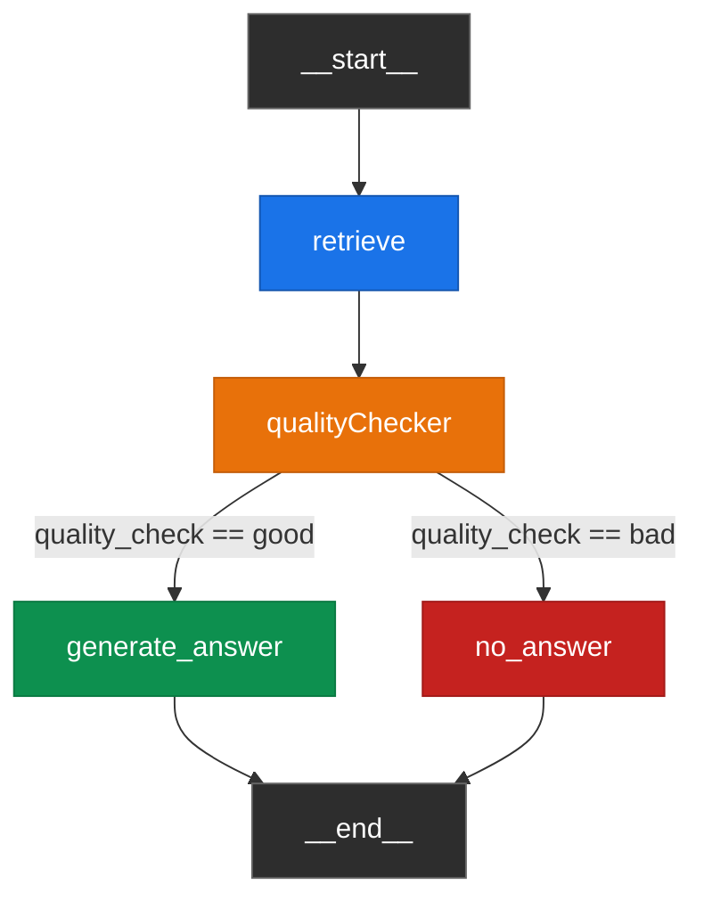
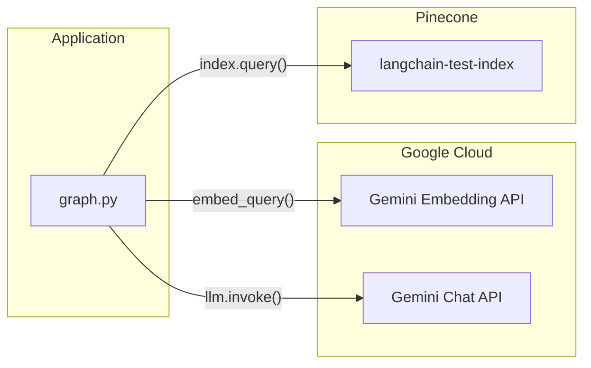

# LangGraph Architecture — Legal RAG Pipeline

## Overview

This project uses [LangGraph](https://langchain-ai.github.io/langgraph/) to orchestrate a Retrieval-Augmented Generation (RAG) pipeline for legal document question-answering. The graph is a directed state machine with **four nodes** and **one conditional edge** that routes between answer generation and a fallback path based on retrieval quality.

---

## Graph Topology



---

## State Schema

The entire pipeline shares a single `RAGState` typed dictionary. Each node reads from and writes to this shared state.

```python
class RAGState(TypedDict):
    question: str           # The user's natural-language question
    chunks: List[dict]      # Retrieved document chunks from Pinecone
    quality_check: str      # "good" or "bad" — set by qualityChecker
    answer: str             # The final answer text
    citations: List[dict]   # Source attributions for the answer
```

### Chunk structure
Each item in `chunks` contains:

| Field | Type | Description |
|---|---|---|
| `chunk_id` | `str` | SHA-256 hash ID of the chunk |
| `text` | `str` | The chunk's text content |
| `source` | `str` | Filename of the source document |
| `score` | `float` | Pinecone cosine similarity score (0–1) |

---

## Node Descriptions

### 1. `retrieve`

**Purpose:** Convert the user's question into a vector and search Pinecone for the most relevant document chunks.

**Inputs from state:** `question`  
**Writes to state:** `chunks`

**Process:**
1. Embed the question using `GoogleGenerativeAIEmbeddings` (`gemini-embedding-2-preview`)
2. Query Pinecone index (`langchain-test-index`) with `top_k=5` and `include_metadata=True`
3. Extract `chunk_id`, `text`, `source`, and `score` from each match
4. Return the list of chunks to state

**External calls:**
- Gemini Embedding API (1 call)
- Pinecone Query API (1 call)

---

### 2. `qualityChecker`

**Purpose:** Determine whether the retrieved chunks contain enough relevant information to answer the question. Acts as a two-stage gate.

**Inputs from state:** `question`, `chunks`  
**Writes to state:** `quality_check`

**Process:**

**Stage 1 — Score filter (cheap):**
1. If no chunks were retrieved → return `"bad"`
2. Find the highest similarity score among retrieved chunks
3. If the highest score < `0.60` threshold → return `"bad"`

**Stage 2 — LLM relevance check (expensive):**
4. Build a context string from all chunks
5. Ask Gemini (`gemini-3.1-flash-lite`) whether the context contains enough information to answer the question
6. Gemini must return exactly `"good"` or `"bad"`
7. If the response is anything else → default to `"bad"` (safety fallback)

**External calls:**
- Gemini Chat API (1 call, only if Stage 1 passes)

**Design rationale:** The score-based check is a fast, free pre-filter that avoids unnecessary LLM calls when retrieval clearly failed. The LLM check catches cases where the score is high but the content is semantically irrelevant.

---

### 3. `generate_answer`

**Purpose:** Generate a grounded answer using the retrieved context.

**Inputs from state:** `question`, `chunks`  
**Writes to state:** `answer`, `citations`

**Process:**
1. Build a context string from all chunks (including source and chunk ID)
2. Prompt Gemini with strict grounding instructions:
   - "Answer using ONLY the provided context"
   - "Do not use outside knowledge"
   - "Do not invent facts"
3. Extract the answer text
4. Set the citation to the source of the highest-scoring chunk

**External calls:**
- Gemini Chat API (1 call)

---

### 4. `no_answer`

**Purpose:** Return a safe fallback when retrieval quality is insufficient.

**Inputs from state:** (none)  
**Writes to state:** `answer`, `citations`

**Process:**
1. Set `answer` to a canned message: *"I cannot find sufficient information to answer this question in the provided documents."*
2. Set `citations` to an empty list

**External calls:** None

---

## Edge & Routing Logic

| From | To | Type | Condition |
|---|---|---|---|
| `__start__` | `retrieve` | Unconditional | Always |
| `retrieve` | `qualityChecker` | Unconditional | Always |
| `qualityChecker` | `generate_answer` | Conditional | `quality_check == "good"` |
| `qualityChecker` | `no_answer` | Conditional | `quality_check == "bad"` |
| `generate_answer` | `__end__` | Unconditional | Always |
| `no_answer` | `__end__` | Unconditional | Always |

The conditional routing is implemented via `route_quality()`, which simply returns `state["quality_check"]`.

---

## Data Flow Example

### Successful answer path

```
User: "What is the notice period in the Bluecrest employment agreement?"

1. retrieve
   → Embeds question → Queries Pinecone → Returns 5 chunks
   → Best chunk from "02_employment_agreement_excerpt.md" (score: 0.82)

2. qualityChecker
   → Score 0.82 > 0.60 → PASSES score check
   → Gemini confirms context is sufficient → Returns "good"

3. generate_answer
   → Builds context from 5 chunks
   → Gemini generates: "Either party may end the agreement by giving 60 days' written notice."
   → Citation: {"source": "02_employment_agreement_excerpt.md"}

→ API returns: { answer, citations, found: true, retrieval_scores }
```

### Fallback path

```
User: "What is the capital of France?"

1. retrieve
   → Embeds question → Queries Pinecone → Returns 5 chunks
   → All chunks are about legal documents, best score: 0.31

2. qualityChecker
   → Score 0.31 < 0.60 → FAILS score check
   → Skips LLM call → Returns "bad"

3. no_answer
   → Returns canned message + empty citations

→ API returns: { answer: "I cannot find...", citations: [], found: false }
```

---

## Configuration Constants

| Constant | Value | Location | Description |
|---|---|---|---|
| `SCORE_THRESHOLD` | `0.60` | `graph.py` | Minimum cosine similarity score to proceed to LLM quality check |
| `top_k` | `5` | `graph.py` | Number of chunks retrieved from Pinecone |
| `recursion_limit` | `5` | `api.py` | LangGraph recursion limit (safety guard) |
| Embedding model | `gemini-embedding-2-preview` | `graph.py` | Google's embedding model (3072 dimensions) |
| LLM model | `gemini-3.1-flash-lite` | `graph.py` | Fast/cheap model for quality checks and answers |
| `temperature` | `0` | `graph.py` | Deterministic LLM outputs |

---

## External Service Dependencies



| Service | Purpose | Calls per `/ask` request |
|---|---|---|
| Gemini Embedding API | Embed user question | 1 |
| Gemini Chat API | Quality check + answer generation | 1–2 (quality check skipped if score too low) |
| Pinecone | Vector similarity search | 1 |
